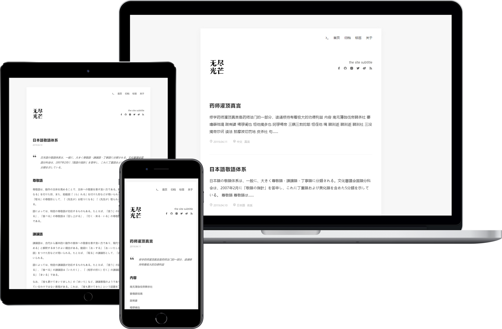

# hugo-theme-zozo

[](https://github.com/imzeuk/hugo-theme-zozo/graphs/contributors)
[](https://github.com/imzeuk/hugo-theme-zozo/blob/master/LICENSE)

> 该主题移植自 [Aragaki](https://github.com/PCDotFan/Aragaki)，结构样式参考自 [菩提树下](https://blog.caicai.me/)。

[在线预览：Demo](https://zeuk.me/example-site/)

## 截图



## 安装

首先进入 hugo 的站点目录运行下面的命令：

```bash
$ git clone https://github.com/imzeuk/hugo-theme-zozo themes/zozo
```

本主题提供了一个示例配置文件是 `exampleSite` 目录里的 `config.toml` 文件。

配置文件中对大部分配置都有详细的注释说明，复制该文件到站点目录下，根据自己的情况修改即可。

更多安装信息查看 Hugo 官方文档 [setup guide](https://gohugo.io/overview/installing/)。

## 示例站点

`exampleSite` 是本主题的一个示例站点，里面有配置文件、关于页面的一些示例。

## 关于页面

使用关于页面，首先要在你的站点目录的 `content` 目录下创建一个 `about` 目录，然后再创建一个 `index.md` 文件，并在文件的 `frontmatter` 中添加  `hidden: true`, 最后编写该文件即可。

## Logo

你需要将 `images` 目录下的 `logo.svg`、`favicon.ico` 都替换为你自己的图像。

## 隐藏页面

如果你不想让一个页面出现在文章列表中，只需要在 markdown 文件的 `frontmatter` 中添加 `hidden: true` 即可。

然后你可以在其他任何地方通过链接来引用该页面，如在菜单中放置一个链接。

关于页面就是这么实现的。

## Valine 评论

本主题提供了 Valine 评论系统，默认为关闭状态，如需使用，需要在 `config.toml` 中进行设置。

设置 `[params.valine]` 下的 `enable = true` 来开启评论系统，并将 `appId` 和 `appKey` 设置为你自己的。


## 社交链接

本主题的社交链接是字体图标的样式，并放置在了页面头部。你可以通过在 `config.toml` 的 `[social]` 模块中修改添加你的社交链接。

## 部署主题

配置完成之后，就可以使用下面的命令来启动 hugo 服务编译 markdown 文件生成静态站点：

```bash
$ hugo server
```

然后在浏览器地址栏输入 [localhost:1313](http://localhost:1313) 来访问站点。

## License

Released under the [MIT](https://github.com/imzeuk/hugo-theme-zozo/blob/master/LICENSE) License.

## 致谢

- [Aragaki](https://github.com/PCDotFan/Aragaki)
- [菩提树下](https://blog.caicai.me/)
